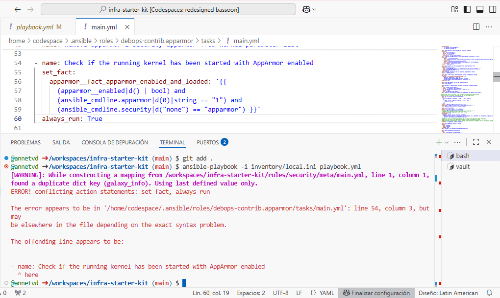
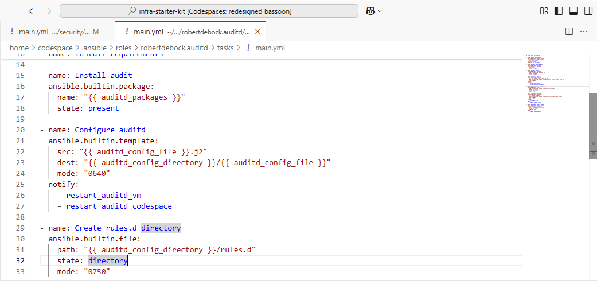
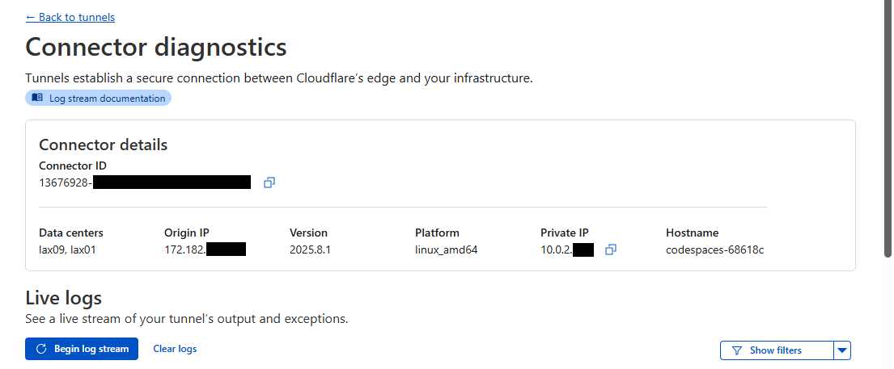
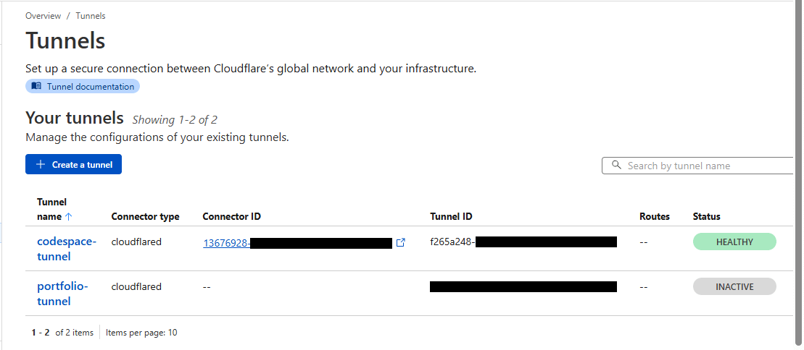
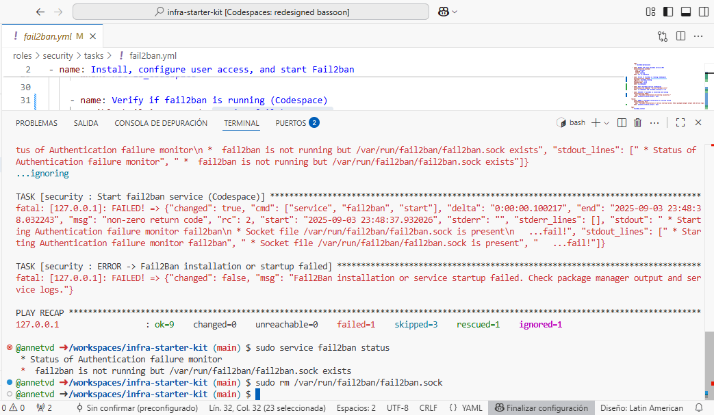

# 🧰 Infra Starter Kit: Production Web Services and Server Security Setup with Ansible
This repository contains a **developing Ansible project** aimed at configuring a remote host as part of migrating my web portfolio to an **Oracle Cloud** instance running **Ubuntu 22.04**.  
The playbook is designed to run reproducibly in **GitHub Codespaces** and automates the installation and configuration of essential services such as **MySQL**, **Apache**, and **Node.js**, along with a set of security measures.

One of the most notable features of this project is that it is designed to operate **without opening inbound ports, without a public IP, and without exposing the network**. Service exposure is handled exclusively through a **Cloudflare Tunnel**, using **Caddy** as a reverse proxy.

This configuration is intentionally limited to a single server, as it is designed to meet the needs of this specific project while keeping the code modular and easy to adapt if requirements change.

> **Note:** So far, this playbook has only been tested in Codespaces. As the project progresses, I will update this repository documenting its behavior on a real host.

<br>

## 📖 Introduction
This project was born from the need to configure my instance from scratch, without prior experience in server administration or security. I initially started by creating manual scripts, but soon discovered **Ansible** and decided to turn the project into a modular, scalable, and reusable solution.

My goal is not only to configure my own infrastructure but also to provide an approachable reference based on what I’ve learned, so other developers can explore and experiment without worrying about breaking a production server.

The project is custom-designed for my web portfolio (publicly available on my GitHub), and many of the security decisions are based on the real needs of that portfolio.<br><br>

### Features implemented up to the latest commit:
- SSH and system users  
- Postfix  
- UFW  
- Fail2ban  
- Auditd  
- AppArmor (coded, pending testing)  
- MySQL  
- Apache  
- PHP  
- Node.js API (pending `.service` file for systemd)  
- Caddy (initial configuration, pending inclusion of `Caddyfile`)  
- Cloudflare Tunnel  
- Unattended-upgrades  
- Logrotate<br><br>

### Next steps:
- Publish portfolio application files to Apache and Node.js services.
- Configure the Apache VirtualHost.
- Include the `.service` file to start the Node.js API.
- Add reverse proxy configuration in the `Caddyfile`.
- Complete auditd rules for sensitive files after deployment.<br><br>

> **Warning:** Production security requires responsibility. If you choose to take inspiration from or use this configuration, do so at your own risk and make sure you understand the implications of each setting.

<br>

## 🚀 Quick Start: Codespaces
To get started, create a Codespace directly from this repository by clicking `Code`, selecting the `Codespaces` tab, and choosing `Create codespace on main`. This will open a **blank Codespace** with **Ubuntu 22.04**. No additional setup is required. This project was developed and tested on Ubuntu 22.04, which is the recommended environment.

This project aims to be accessible for review and learning:
- All variables used by the playbook are public and initialized with dummy values.
- For sensitive data that must be valid (e.g., Cloudflare Tunnel token), **HashiCorp Vault** is used to securely inject values at runtime.<br><br>

### 1. Prepare the Environment
Run the following commands inside your Codespace terminal:

```bash
# Ensure Ansible does not ignore `ansible.cfg` due to unsafe directory permissions
chmod go-w .

# Upgrade pip and install Ansible + required Python dependencies
sudo python3 -m pip install --upgrade pip
sudo python3 -m pip install --upgrade ansible jinja2 PyYAML cryptography packaging passlib hvac
```

Install required Ansible collections and roles:

```bash
ansible-galaxy collection install -r requirements.yml --force
ansible-galaxy role install -r requirements.yml
```

<br>

> **Note:** In Codespaces, the current `ansible.cfg` should work out-of-the-box. If Ansible cannot find roles or collections, check `ansible --version` and adjust the `roles_path` or `collections_paths` accordingly.

<br>

### 2. Fix Deprecated Attribute in `debops-contrib.apparmor`

One of the roles installed (`debops-contrib.apparmor`) uses a deprecated attribute (`always_run`), which will cause the playbook to fail on the first run.



Open the file:

```bash
code /home/codespace/.ansible/roles/debops-contrib.apparmor/tasks/main.yml
```

Find the line containing `always_run: true`, delete it, and save the file. This step is required only once per Codespace environment.<br><br>

### 3. Adjust `auditd` Handler for Codespaces
The role `robertdebock.auditd` uses a handler that restarts auditd via `systemd` if the task **Configure auditd** changes. This will fail on Codespaces because `systemd` is not available in the container.

To fix this issue, follow these steps:

1. Open the file `/home/codespace/.ansible/roles/robertdebock.auditd/tasks/main.yml`.
2. Locate the `notify` line in the **Configure auditd** task.
3. Replace the default handler with `restart_auditd_vm` and `restart_auditd_codespace`, as shown in the screenshot below.
4. Save the file.



Both handlers are defined in [`security/handlers/main.yml`](roles/security/handlers/main.yml) and already support the `is_codespace` variable. This modification ensures the playbook does not fail when running inside Codespaces.

Alternatively, you may comment out the auditd block entirely in [`security/tasks/main.yml`](roles/security/tasks/main.yml).

<br>

> **Warning:** Avoid using `--skip-tags` to skip the `robertdebock.auditd` role unless you are certain you have removed all auditd-related tags across the entire project (e.g., the `logrotate` module), as skipping them can cause unexpected behavior.

<br>

### 4. Install and Run HashiCorp Vault (Dev Mode)
This project uses Vault to store sensitive variables (e.g., Cloudflare tokens, SSH keys).

```bash
# Download and install Vault
curl -O https://releases.hashicorp.com/vault/1.15.4/vault_1.15.4_linux_amd64.zip
unzip vault_1.15.4_linux_amd64.zip
sudo mv vault /usr/local/bin/
rm vault_1.15.4_linux_amd64.zip

# Start Vault in development mode (ephemeral)
vault server -dev
```

In a separate terminal tab, export the environment variables using the specified token:

```bash
export VAULT_ADDR="http://127.0.0.1:8200"
export VAULT_TOKEN="s.XXXXXXXXXXXXXXXXXXXX"
```

Initialize required secrets:

```bash
vault kv put secret/cloudflare tunnel_token="my_demo_token"
vault kv put secret/ssh system_user_public_key="ssh-rsa AAAAB3Nza..."
```

<br>

### 5. Run the Playbook
Run the playbook using the local inventory:

```bash
ansible-playbook -i inventory/local.ini playbook.yml
```

<br>

### 6. Controlling Output with Tags
This playbook is filled with tags to make testing and reusing specific components easier. The following tags allow you to skip the personalized success messages:
- success → All success messages.
- success:done → Messages marking module completion.
- success:stage → Messages marking block-level completion.

Example: run the playbook without success messages:

```bash
ansible-playbook -i inventory/local.ini playbook.yml --skip-tags success
ansible-playbook -i inventory/local.ini playbook.yml --skip-tags success:stage
```

<br>

Example: skip package installation for faster runs (useful when re-running after initial setup):

```bash
ansible-playbook -i inventory/local.ini playbook.yml --skip-tags install,success:stage
```

> **Note:** Even though Ansible is idempotent (it won’t reinstall packages that are already present), package installation tasks still take time to run because Ansible needs to check the current state of each package. Skipping them on subsequent runs can significantly reduce execution time.

<br>

When targeting specific tasks, include the always tag to ensure environment detection runs:

```bash
ansible-playbook -i inventory/local.ini playbook.yml --tags always,ufw --skip-tags install,success
```

> **Warning:** Many services are interconnected (e.g., Postfix + Fail2ban, Apache + PHP, global Logrotate), running only specific tags (e.g., fail2ban) without having the dependent services installed or configured may lead to errors (e.g., missing log paths). It is recommended to run the **entire playbook at least once** on a fresh Codespace, then re-run as needed.

<br>

### Codespaces Behavior
> **Important:** Codespaces reset or change some state when the container is stopped and restarted.
> After reopening your Codespace, re-run the playbook to ensure all configurations are restored.

<br>

### Key Takeaways
- ✅ Designed to run safely in Codespaces (automatic environment detection).
- ✅ Provides success messages by default, which can be silenced using --skip-tags.
- ✅ Implements idempotent configurations but allows skipping installs for speed.
- ⚠️ Some tasks depend on services being present (e.g., logrotate configs), so partial runs may fail if prerequisites are missing.<br><br>

## 📐 Design Decisions & Implementation Notes
Throughout this project, I’ve added detailed comments beginning with `Note:`, these are meant to highlight sensitive or important configurations that deserve extra attention.

When working in GitHub Codespaces, you can easily search for `Note:` using Visual Studio Code’s search tool to navigate through all of them.

I encourage anyone reviewing or modifying this playbook to read those notes carefully before making changes, as they often explain why a task was written in a particular way and how to avoid misconfigurations.

Almost every configuration in this project has been centralized into variables, located mainly in:
- [`group_vars/all.yml`](group_vars/all.yml)
- [`defaults/main.yml`](roles/security/defaults/main.yml)
- [`vars/main.yml`](roles/security/vars/main.yml)

This means there are no “hidden” hardcoded values in the tasks. If you review the variable files and the `Note:` comments, you can be confident that the playbook will not introduce unexpected configurations.<br><br>

### Use of `merge_vars`

This playbook explicitly uses the **`merge_vars`** variable, which is disabled by default in [`defaults/main.yml`](roles/security/defaults/main.yml). This was a deliberate choice to keep configurations consistent when dealing with multiple services at once.

The logic works as follows:
- `merge_vars: true` must be set to enable variable merging.
- `merge_vars_verified` is initially set to `false`, which makes Ansible print the merged values for **human verification** before continuing.
- Once the output is confirmed correct, set `merge_vars_verified: true` to proceed with the playbook execution.<br><br>

This design focuses on:
- **Centralizing service ports** (for Apache, Node.js API, and Caddy), ensuring consistency when services are configured or updated.
- Centralizing `log_path` values used by **logrotate** in the `log_files_services` variable, ensuring that all services reference the correct paths.
- Reducing human error when configuring many services at once.
- Centralizing **Fail2ban** service groups via `fail2ban_web_services`, automatically generated from dictionaries in [`group_vars/all.yml`](group_vars/all.yml). This ensures consistency and eliminates duplication.<br><br>

You can inspect the tasks responsible for variable merging in [`tasks/merge_vars.yml`](roles/security/tasks/merge_vars.yml). They are written to **avoid overwriting values that are already set**. So even if `merge_vars: true` is set, existing correct configurations will remain untouched.

An example of what the merged variables look like:

```yaml
# The first property, `fail2ban_needs_access`, indicates which services in `group_vars/all.yml` require
# Fail2ban access to be granted. Only services with `fail2ban_needs_access: true` are included in
# the `fail2ban_web_services` variable. Services like Apache have `fail2ban_needs_access: false`
# because they use Fail2ban filters and jails but do not need extra access permissions.
fail2ban_web_services:
  - fail2ban_needs_access: true
    group: portfolio_api
    name: portfolio_api
  - fail2ban_needs_access: true
    group: caddy
    name: caddy

fail2ban_jails:
  - enabled: true
    filter: sshd
    jail_name: sshd
    log_path: /var/log/auth.log
    maxretry: 4
    name: sshd
    port: ssh
  - enabled: true
    filter: mysqld-auth
    jail_name: mysqld-auth
    log_path: /var/log/mysql/error.log
    maxretry: 3
    name: mysql
    port: 3306
  - bantime: 43200
    enabled: true
    filter: apache-badbots
    findtime: 3600
    jail_name: apache-badbots
    log_path: /var/log/apache2/access.log
    maxretry: 1
    name: apache2
    port: 8080
```

<br>

> **Note:** If you disable `merge_vars` by removing `merge_vars: true` and `merge_vars_verified: true` from the playbook, you must manually define variables in this format.

<br>

### Node.js API External Access
The **Node.js API** was initially intended to connect from an external server to MySQL on the server currently being configured, which is why some remnants of this design remain in the playbook (e.g., the `foreign_node_api_ip` variable).

When I started the project, I had not yet encountered **Cloudflare Tunnels**, but I now view them as essential for securely exposing any services externally, even though the playbook is designed to configure each security point restrictively.

In the current commit, MySQL does **not** allow any external connections for security reasons. Any access to MySQL or other services from outside the host should go through the **Cloudflare Tunnel** with **Caddy** as the reverse proxy.<br><br>

### Database Import Logic
Database import in [`tasks/mysql_import_db.yml`](roles/security/tasks/mysql_import_db.yml) is controlled via the `mysql_databases` variable, which includes the following attributes:
- `name`: the database name.
- `init_id`: identifier used to track if the database dump has already been imported.
- `dump_file_path`: path to the SQL dump file on the local machine (where the playbook is executed), not on the host being configured.
- `init_when`: condition to initialize the import, either `"database empty"` or `"not .imported"` (the latter uses `init_id` to determine if the import has already been applied).<br><br>

The `.imported` flag file is stored in `/var/lib/infra-starter-kit/security/mysql` on the host being configured. It prevents the playbook from overwriting the database when rerun.

**The target database must exist** (even if empty). The tasks that create it are defined in [`tasks/mysql_db_and_users.yml`](roles/security/tasks/mysql_db_and_users.yml).

If only the `name` attribute is provided in `mysql_databases` without using MySQL-specific tags, the playbook will create the database without errors and continue execution. Providing additional attributes will also trigger the import of the dump.

In `mysql_users`, the `host` property defaults to `localhost` if not specified.<br><br>

> **Note:** The database dumps included in this repository are fully **functional** and can be imported, but they contain only **fictitious data** and placeholder relationships.<br>
> They were generated with AI and inspired by the schemas used in my portfolio and demo. Their purpose is purely illustrative and intended for testing scenarios, not for production use.

<br>

### Cloudflare Tunnel Setup
The **Cloudflare Tunnel** was set up following **Cloudflare Zero Trust** guidelines, using only the provided token for authentication. All DNS and additional configuration should be handled via the Cloudflare web interface, not directly on the host.

The screenshots below show the information Cloudflare receives from the Codespace host and confirm that the tunnel is connected and healthy.<br><br>

**Connector diagnostics** – Displays details of the Codespace host, such as private IP, platform, origin IP, and hostname:

<br><br>

**Tunnel list** – Shows the Codespace tunnel in the Cloudflare dashboard with a **healthy** status:

<br><br>

> **Note:** This configuration allows external access to services in a controlled and secure manner through the tunnel. Direct external connections to the host are not allowed, and all service traffic should flow through the Cloudflare Tunnel using **Caddy** as the reverse proxy.

<br>

### Detecting Codespaces Environment
The `playbook.yml` includes a task to detect if the playbook is being **executed from a GitHub Codespace**:

```yaml
- name: Detect if running inside GitHub Codespaces
  set_fact:
    is_codespace: "{{ ansible_env.CODESPACES is defined }}"
```

This detection checks **where the playbook is running (the controller machine)**, not the remote host being configured.

This design allows the playbook to be executed both in a Codespace container for local configuration **and** on a laptop (or other non-Codespace environment) to configure a remote host.

Hypothetically, if you wanted to use a Codespace container to configure a remote host instead of the container itself, you would need to manually set `is_codespace: false`. This instructs the playbook to treat the target environment as a standard host suitable for production deployment.<br><br>

### Codespaces Adaptation and `is_codespace` Usage
The `is_codespace` variable is used to conditionally adapt the playbook when running inside GitHub Codespaces. It ensures that tasks requiring host-specific features or services unavailable in the container are handled safely, while still simulating production behavior where possible.

For example:
- **Systemd units** cannot be used inside Codespaces. Consequently, the Cloudflare Tunnel service is run directly using its binary (`cloudflared`) as defined in its `.service` unit.
- Other services that normally rely on **systemd** are started with `service service_name start` to approximate production behavior. 
- Features that cannot be safely simulated in the container, such as **AppArmor** or the global **logrotate** test, are skipped to maintain automation and avoid breaking the playbook.

This approach allows the playbook to be run and tested in Codespaces while closely simulating a real production host configuration.<br><br>

## 🛠️ Tips & Troubleshooting
### Logrotate Configuration Files
When editing logrotate configuration files via the browser editor, line breaks may introduce hidden characters (e.g., carriage return `^M`) that are not visible but can cause `logrotate` to fail when testing a specific configuration:

```bash
logrotate -d /etc/logrotate.d/{{ item.name }}
```

<br>

To identify and clean these hidden characters:

**1. Display hidden characters using:**
```bash
sudo cat -A /workspaces/infra-starter-kit/roles/security/files/logrotate_conf_file.conf
```
Line endings should appear as `$` at the end of each line.<br><br>

**2. Remove problematic carriage returns using:**
```bash
sudo sed -i 's/\r$//' /workspaces/infra-starter-kit/roles/security/files/logrotate_conf_file.conf
```

<br>

This ensures the logrotate configuration is valid and prevents errors caused by invisible characters.<br><br>

### Fail2ban Socket Issue (Codespaces)
Sometimes, Fail2ban may fail to start during a rerun, displaying an error similar to the one shown in the screenshot below:



This occurs because the fail2ban socket from the previous session still exists, even though the service was stopped in the Codespace. To resolve this, remove the socket:

```bash
sudo rm /var/run/fail2ban/fail2ban.sock
```

After this, starting Fail2ban should work normally.