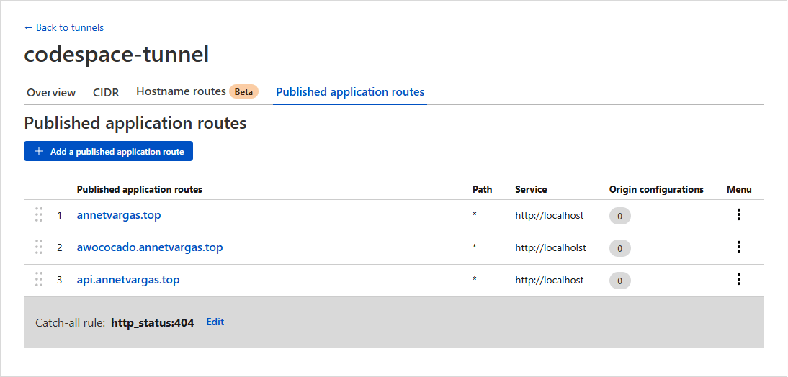

# 🧰 Infra Starter Kit: Production Web Services and Server Security Setup with Ansible
This repository contains a **developing Ansible project** aimed at configuring a remote host as part of migrating my web portfolio to an **Oracle Cloud** instance running **Ubuntu 22.04**.  
The playbook is designed to run reproducibly in **GitHub Codespaces** and automates the installation and configuration of essential services such as **MySQL**, **Apache**, and **Node.js**, along with a set of security measures.

The primary feature of this project is that the resulting host configuration is designed to operate **without opening inbound ports, without a public IP, and without exposing the network**. Service exposure is handled exclusively through a **Cloudflare Tunnel**, using **Caddy** as a reverse proxy.


This configuration is intentionally limited to a single server, as it is designed to meet the needs of this specific project while keeping the code modular and easy to adapt if requirements change.

> **Note:** So far, this playbook has only been tested in Codespaces. As the project progresses, I will update this repository documenting its behavior on a real host.

<br>

## 📖 Introduction
This project was born from the need to configure my instance from scratch, without prior experience in server administration or security. I initially started by creating manual scripts, but soon discovered **Ansible** and decided to turn the project into a modular, scalable, and reusable solution.

My goal is not only to configure my own infrastructure but also to provide an approachable reference based on what I’ve learned, so other developers can explore and experiment without worrying about breaking a production server.

The project is custom-designed for my web portfolio (publicly available on [my GitHub](https://github.com/annetvd/annetvargas-web-portfolio)), and many of the security decisions are based on the real needs of that portfolio.<br><br>

### Features implemented up to the latest commit:
- SSH and system users  
- Exim4
- UFW  
- Fail2ban  
- Auditd  
- AppArmor (coded, pending testing)  
- MySQL  
- Apache  
- PHP  
- Node.js API 
- Caddy 
- Cloudflare Tunnel  
- Unattended-upgrades  
- Logrotate<br><br>

### Next steps:
The next phase of this project is to **test the current configuration on an Oracle Cloud instance** as part of the migration of my portfolio. All roles and tasks have already been validated in GitHub Codespaces, where the playbooks successfully configured, deployed, and orchestrated the core services responsible for security and basic functionality, including Cloudflare Tunnel (Cloudflared), Caddy, Apache, MySQL, and Node.js, all working together seamlessly under my portfolio domain [annetvargas.top](https://annetvargas.top).<br><br>

### Operational Overview
A demonstration video is available to illustrate how the configured services interact once the playbooks have been applied. The recording was made directly in **GitHub Codespaces** and shows the environment starting from a clean state: the log files for **Caddy** and **Apache** are initially empty, the **Node.js API** logs are visible from the terminal, and the **Cloudflare Tunnel** logs are displayed in the Cloudflare dashboard.

After making several requests from the browser, the video shows how the logs from Caddy, Apache, and the Node.js API align with those from Cloudflare, confirming correct routing and proxy synchronization through the tunnel.

🎥 Watch the demonstration: [View on Google Drive](https://drive.google.com/file/d/1JT6EXyasIJqCh6bwP-R3HbV7fV_p8EEA/view?usp=sharing)<br><br>


> **Warning:** Production security requires responsibility. If you choose to take inspiration from or use this configuration, do so at your own risk and make sure you understand the implications of each setting.

<br>

## 🚀 Quick Start: Codespaces
To get started, create a Codespace directly from this repository by clicking `Code`, selecting the `Codespaces` tab, and choosing `Create codespace on main`. This will open a **blank Codespace** with **Ubuntu 22.04**. No additional setup is required. This project was developed and tested on Ubuntu 22.04, which is the recommended environment.

This project aims to be accessible for review and learning:
- All variables used by the playbooks are public and initialized with dummy values.
- For sensitive data that must be valid (e.g., Cloudflare Tunnel token), **HashiCorp Vault** is used to securely inject values at runtime.<br><br>

### 1. Prepare the Environment
Run the following commands inside your Codespace terminal:

```bash
# Ensure Ansible does not ignore `ansible.cfg` due to unsafe directory permissions
chmod go-w .

# Upgrade pip and install Ansible + required Python dependencies
sudo python3 -m pip install --upgrade pip
sudo python3 -m pip install --upgrade ansible jinja2 PyYAML cryptography packaging passlib hvac
```

Install required Ansible collections and roles:

```bash
ansible-galaxy collection install -r requirements.yml --force
ansible-galaxy role install -r requirements.yml
```

<br>

> **Note:** In Codespaces, the current `ansible.cfg` should work out-of-the-box. If Ansible cannot find roles or collections, check `ansible --version` and adjust the `roles_path` or `collections_paths` accordingly.

<br>

### 2. Fix Deprecated Attribute in `debops-contrib.apparmor`

One of the roles installed (`debops-contrib.apparmor`) uses a deprecated attribute (`always_run`), which will cause the playbook to fail on the first run.


Open the file:

```bash
code /home/codespace/.ansible/roles/debops-contrib.apparmor/tasks/main.yml
```

Find the line containing `always_run: true`, delete it, and save the file. This step is required only once per Codespace environment.<br><br>

### 3. Adjust `auditd` Handler for Codespaces
The role `robertdebock.auditd` uses a handler that restarts auditd via `systemd` if the task **Configure auditd** changes. This will fail on Codespaces because `systemd` is not available in the container.

To fix this issue, follow these steps:

1. Open the file `/home/codespace/.ansible/roles/robertdebock.auditd/tasks/main.yml`.
2. Locate the `notify` line in the **Configure auditd** task.
3. Replace the default handler with `restart_auditd_vm` and `restart_auditd_codespace`, as shown in the screenshot below.
4. Save the file.


Both handlers are defined in [`security/handlers/main.yml`](roles/security/handlers/main.yml) and already support the `is_codespace` variable. This modification ensures the playbook does not fail when running inside Codespaces.

Alternatively, you may comment out the auditd block entirely in [`security/tasks/main.yml`](roles/security/tasks/main.yml).

<br>

> **Warning:** Avoid using `--skip-tags` to skip the `robertdebock.auditd` role unless you are certain you have removed all auditd-related tags across the entire project (e.g., the `logrotate` module), as skipping them can cause unexpected behavior.

<br>

### 4. Install and Run HashiCorp Vault (Dev Mode)
This project uses Vault to store sensitive variables (e.g., Cloudflare tokens, SSH keys).

```bash
# Download and install Vault
curl -O https://releases.hashicorp.com/vault/1.15.4/vault_1.15.4_linux_amd64.zip
unzip vault_1.15.4_linux_amd64.zip
sudo mv vault /usr/local/bin/
rm vault_1.15.4_linux_amd64.zip

# Start Vault in development mode (ephemeral)
vault server -dev
```

In a separate terminal tab, export the environment variables using the specified token:

```bash
export VAULT_ADDR="http://127.0.0.1:8200"
export VAULT_TOKEN="xxx.xxxxxxxxxxxxxxxxx"
```

Initialize required secrets:

```bash
vault kv put secret/ssh system_user_public_key="ssh-rsa xxxxxxxxxxxxx..."
vault kv put secret/exim4 email_app_password="xxxx xxxx xxxx xxxx"
vault kv put secret/cloudflare tunnel_token="my_token"
```

<br>

### 5. Run the Security Playbook
Run the security playbook using the local inventory to configure system security, install required packages, set up users, and initialize core services:

```bash
ansible-playbook -i inventory/local.ini security.yml
```

This step prepares the system for web service deployment and runtime configuration. For more details about the `security` role, see [Design Decisions & Implementation Notes](#-design-decisions--implementation-notes).

<br>

> **Note:** In Codespaces, the Cloudflare Tunnel may stop a few minutes after running the `security.yml` playbook. The tunnel is initially created correctly and its connection can be verified in the Cloudflare dashboard. After completing the full setup with `deploy.yml` and `runtime_setup.yml`, the tunnel may stop; in such cases, it should be restarted manually from the terminal using the same command (`sudo tunnel run --token cloudflare_tunnel_token`), and it will remain active for testing purposes. The associated task is intended solely for Codespaces testing and will not be investigated further at this time. Any issues discovered in production that indicate a problem with the playbook will be fixed and documented accordingly.

<br>

### 6. Deploy Web Services
You can deploy the **Apache** and **Node.js** web services using your preferred method. For convenience, a provisional `deploy.yml` playbook is provided.

Steps to implement the playbook:
- Create a folder named `deploy` in the repository containing `apache_service` and `node_service` subfolders, at the same level as `roles` and `group_vars`.
- Place your service files inside the corresponding subfolders.
- Run the playbook:

```bash
ansible-playbook -i inventory/local.ini deploy.yml
```

This playbook copies the content of the `apache_service` and `node_service` folders to the appropriate directories and installs Node.js dependencies.

<br>

> **Note:** In this step, you only need to deploy the applications. Directory permissions, service initialization, and other critical configurations will be handled in the next playbook.

<br>

### 7. Run the Runtime Setup Playbook

After deploying the applications, run the runtime setup playbook to finalize the configuration and orchestrate services:

```bash
ansible-playbook -i inventory/local.ini runtime_setup.yml
```

<br>

### 8. Controlling Output with Tags
These playbooks are filled with tags to make testing and reusing specific components easier. The following tags allow you to skip the personalized success messages:
- success → All success messages.
- success:done → Messages marking module completion.
- success:stage → Messages marking block-level completion.

Example: run the security playbook without success messages:

```bash
ansible-playbook -i inventory/local.ini security.yml --skip-tags success
ansible-playbook -i inventory/local.ini security.yml --skip-tags success:stage
```

<br>

Example: skip package installation for faster runs (useful when re-running after initial setup):

```bash
ansible-playbook -i inventory/local.ini security.yml --skip-tags install,success:stage
```

> **Note:** Even though Ansible is idempotent (it won’t reinstall packages that are already present), package installation tasks still take time to run because Ansible needs to check the current state of each package. Skipping them on subsequent runs can significantly reduce execution time.

<br>

When targeting specific tasks, include the **always** tag to ensure environment detection runs:

```bash
ansible-playbook -i inventory/local.ini security.yml --tags always,ufw --skip-tags install,success
```

<br>

You may also notice a special **includes** tag in these playbooks. This tag exists to ensure that when you target a lower-level tag like `install`, Ansible actually evaluates the imported tasks and decides which ones to run or skip.

For example, `ufw` is a high-level tag, it is defined on the include itself, so when you run `--tags ufw`, Ansible will automatically pull in all tasks related to UFW. However, keep in mind that even a high-level tag like `ufw` might be used as a "low-level" tag inside other `include_tasks` (for example, within a `mysql` or `logrotate` module).

Because of this, if you only target a low-level tag like `install` and do not specify any high-level tag (like `apache`, `caddy`, or `mysql`) that would normally import those tasks, they will never be included in the play execution.

That’s why, whenever you are running a subset of tasks with `--tags`, it’s a good practice to also include the special `includes` tag. This ensures Ansible first loads all relevant task files, so it can decide which ones to execute or skip based on your selected tags:

```bash
ansible-playbook -i inventory/local.ini security.yml --tags always,includes,install
```

<br>

> **Warning:** Many services are interconnected (e.g., Exim4 + Fail2ban, Apache + PHP, global Logrotate), running only specific tags (e.g., fail2ban) without having the dependent services installed or configured may lead to errors (e.g., missing log paths). It is recommended to run the **entire playbook at least once** on a fresh Codespace, then re-run as needed.

<br>

### Codespaces Behavior
> **Important:** Codespaces reset or change some state when the container is stopped and restarted.
> After reopening your Codespace, re-run the playbook to ensure all configurations are restored.

<br>

### Key Takeaways
- ✅ Designed to run safely in Codespaces (automatic environment detection).
- ✅ Provides success messages by default, which can be silenced using --skip-tags.
- ✅ Implements idempotent configurations but allows skipping installs for speed.
- ⚠️ Some tasks depend on services being present (e.g., logrotate configs), so partial runs may fail if prerequisites are missing.<br><br>

## 📐 Design Decisions & Implementation Notes
This project is organized around two main roles and three playbooks, each serving a specific purpose.

The **roles** are tightly coupled and depend on each other, either to complete their configuration or to ensure that the underlying environment matches the expected settings.

- `security`: This role serves as the foundation of the entire setup. It handles system hardening, package installation, and service configuration, among other tasks.<br>
It prepares the environment for both web service deployment and runtime execution. It manages SSH and system users, Exim4, AppArmor, UFW, Fail2ban, Apache, PHP, MySQL, Node.js API, Caddy, Cloudflare Tunnel, Logrotate, and Unattended-Upgrades.
- `runtime_setup`: This role is executed after the web services have been deployed. It finalizes the configuration and orchestration of the web stack, including Apache, Node.js, and Caddy, and implements the Audit rules.<br>
Specifically, it copies the Caddyfile to the remote host, configures Apache virtual hosts, ensures correct permissions for Apache and Node.js API files, registers the Node.js API as a systemd service, and installs Auditd rules.<br>
Auditd configuration is handled here (rather than in the security role) because the `robertdebock.auditd` role replaces existing rules with those in the `auditd_rules` variable on each run. For this reason, it is applied only after the deployment phase, once all paths to be audited are properly configured.

Shared variables used across both roles are defined in [`group_vars/all.yml`](group_vars/all.yml)
, ensuring uniform configuration and behavior throughout the entire system.<br><br>

**Playbooks**
- `security.yml`: Executes the security role to set up system hardening, core services, and environment preparation.
- `deploy.yml`: A quick-start playbook for Codespaces that provides a ready-to-run deployment of Apache and Node.js web services. It is intended as a convenience tool, while allowing users to choose their preferred deployment approach, such as cloning from a Git repository or manually copying files.<br>
It simply copies the contents of the `deploy/apache_service` and `deploy/node_service` subfolders to the corresponding directories on the remote host and installs Node.js dependencies (see [Quick Start: Codespaces](#6-deploy-web-services) for implementation details).
- `runtime_setup.yml`: Loads the runtime_setup role. It runs after deployment to complete the configuration and startup of all web-related services.<br><br>

### Internal Documentation & Configuration Mapping
Throughout this project, I’ve added detailed comments beginning with `Note:`, these are meant to highlight sensitive or important configurations that deserve extra attention.

When working in GitHub Codespaces, you can easily search for `Note:` using Visual Studio Code’s search tool to navigate through all of them.

I encourage anyone reviewing or modifying this playbook to read those notes carefully before making changes, as they often explain why a task was written in a particular way and how to avoid misconfigurations.

Almost every configuration in this project has been centralized into variables defined in:
- [`group_vars/all.yml`](group_vars/all.yml)
- Each role’s `defaults/main.yml`
- Each role’s `vars/main.yml`

This means there are no “hidden” hardcoded values in the tasks. If you review the variable files and the `Note:` comments, you can be confident that the playbook will not introduce unexpected configurations.<br><br>

### Use of `merge_vars`
The security playbook explicitly uses the **`merge_vars`** variable, which is disabled by default in [`defaults/main.yml`](roles/security/defaults/main.yml). This was a deliberate choice to keep configurations consistent when dealing with multiple services at once.

The logic works as follows:
- `merge_vars: true` must be set to enable variable merging.
- `merge_vars_verified` is initially set to `false`, which makes Ansible print the merged values for **human verification** before continuing.
- Once the output is confirmed correct, set `merge_vars_verified: true` to proceed with the playbook execution.<br><br>

This design focuses on:
- **Centralizing service ports** (for Apache, Node.js API, and Caddy), ensuring consistency when services are configured or updated.
- Centralizing `log_path` values used by **logrotate** in the `log_files_services` variable, ensuring that all services reference the correct paths.
- Reducing human error when configuring many services at once.
- Centralizing **Fail2ban** service groups via `fail2ban_web_services`, automatically generated from dictionaries in [`group_vars/all.yml`](group_vars/all.yml). This ensures consistency and eliminates duplication.<br><br>

You can inspect the tasks responsible for variable merging in [`tasks/merge_vars.yml`](roles/security/tasks/merge_vars.yml). They are written to **avoid overwriting values that are already set**. So even if `merge_vars: true` is set, existing correct configurations will remain untouched.

An example of what the merged variables look like:

```yaml
# The first property, `fail2ban_needs_access`, indicates which services in `group_vars/all.yml` require
# Fail2ban access to be granted. Only services with `fail2ban_needs_access: true` are included in
# the `fail2ban_web_services` variable. Services like Apache have `fail2ban_needs_access: false`
# because they use Fail2ban filters and jails but do not need extra access permissions.
fail2ban_web_services:
  - fail2ban_needs_access: true
    group: portfolio_api
    name: portfolio_api
  - fail2ban_needs_access: true
    group: caddy
    name: caddy

fail2ban_jails:
  - enabled: true
    filter: sshd
    jail_name: sshd
    log_path: /var/log/auth.log
    maxretry: 4
    name: sshd
    port: ssh
  - enabled: true
    filter: mysqld-auth
    jail_name: mysqld-auth
    log_path: /var/log/mysql/error.log
    maxretry: 3
    name: mysql
    port: 3306
  - bantime: 43200
    enabled: true
    filter: apache-badbots
    findtime: 3600
    jail_name: apache-badbots
    log_path: /var/log/apache2/access.log
    maxretry: 1
    name: apache2
    port: 8080
```

<br>

> **Note:** If you disable `merge_vars` by removing `merge_vars: true` and `merge_vars_verified: true` from the playbook, you must manually define variables in this format.

<br>

### Node.js API External Access
A foreign **Node.js API** was originally intended to connect to MySQL from an external server, which is why some traces of that design remain in the security playbook (e.g., the `foreign_node_api_ip` variable).

When I started the project, I had not yet encountered **Cloudflare Tunnels**, but I now view them as essential for securely exposing any services externally, even though the playbooks are designed to configure each security point restrictively.

In the current commit, MySQL does **not** allow any external connections for security reasons. Any access to MySQL or other services from outside the host should go through the **Cloudflare Tunnel** with **Caddy** as the reverse proxy.<br><br>

### Database Import Logic
Database import in [`security/tasks/mysql_import_db.yml`](roles/security/tasks/mysql_import_db.yml) is controlled via the `mysql_databases` variable, which includes the following attributes:
- `name`: the database name.
- `init_id`: identifier used to track if the database dump has already been imported.
- `dump_file_path`: path to the SQL dump file on the local machine (where the playbook is executed), not on the host being configured.
- `init_when`: condition to initialize the import, either `"database empty"` or `"not .imported"` (the latter uses `init_id` to determine if the import has already been applied).<br><br>

The `.imported` flag file is stored in `/var/lib/infra-starter-kit/security/mysql` on the host being configured. It prevents the playbook from overwriting the database when rerun.

**The target database must exist** (even if empty). The tasks that create it are defined in [`tasks/mysql_db_and_users.yml`](roles/security/tasks/mysql_db_and_users.yml).

If only the `name` attribute is provided in `mysql_databases` without using MySQL-specific tags, the security playbook will create the database without errors and continue execution. Providing additional attributes will also trigger the import of the dump.

In `mysql_users`, the `host` property defaults to `localhost` if not specified.<br><br>

> **Note:** The database dumps included in this repository are fully **functional** and can be imported, but they contain only **fictitious data** and placeholder relationships.<br>
> They were generated with AI and inspired by the schemas used in my portfolio and demo. Their purpose is purely illustrative and intended for testing scenarios, not for production use.

<br>

### MySQL Post-Setup Connection
By default, MySQL restricts access to the local UNIX socket (`localhost`) on many Linux distributions, including Ubuntu, allowing only users with the required permissions to connect through it. To maintain consistent and controlled communication between services, the architecture presented in this project deliberately enforces TCP-based local connections over `127.0.0.1` instead of relying on the UNIX socket. In other words, connections that would normally use `localhost` should instead use `127.0.0.1`.

This behavior only affects how connections are made, not how users are defined in MySQL. As shown in this repository, users are still created with the host `localhost` (e.g., `user@localhost`), which remains valid and fully functional with connections through `127.0.0.1`.

Example of a Node.js API connection for a MySQL user with host set to localhost using TCP (127.0.0.1):

```js
const connection = await mysql.createConnection({
  host: "127.0.0.1",
  user: process.env.DB_USER,
  password: process.env.DB_PASSWORD,
  database: process.env.DB_NAME
});
```

<br>

### Cloudflare Tunnel Setup
The **Cloudflare Tunnel** was set up following **Cloudflare Zero Trust** guidelines, using only the provided token for authentication. All DNS and additional configuration should be handled via the Cloudflare web interface, not directly on the host.

The screenshots below show the information Cloudflare receives from the Codespace host and confirm that the tunnel is connected and healthy.<br><br>

**Connector diagnostics** – Displays details of the Codespace host, such as private IP, platform, origin IP, and hostname:

<br><br>

**Tunnel list** – Shows the Codespace tunnel in the Cloudflare dashboard with a **healthy** status:

<br><br>

> **Note:** As mentioned previously, all external access to services in this project is routed securely through the Cloudflare Tunnel. Direct connections to the host are not allowed, and all traffic to services like Node.js or Apache must pass through the tunnel with Caddy acting as the reverse proxy, ensuring a consistent and secure configuration.

<br>

### Cloudflare Domain Settings for Tunnel Traffic
To route traffic securely for this project between the domain, Cloudflare, Caddy, and the web services, **Cloudflare** must be configured to **manage DNS** and **enforce HTTPS redirection** to ensure that traffic remains secure and that both Caddy and the web services operate behind a consistent and protected layer.

For the **Cloudflare Tunnel** to route traffic from the domain, **Cloudflare must manage the DNS records**. If the domain is registered directly through Cloudflare, no additional configuration is required, since DNS management is enabled by default. However, if the domain was purchased from another provider, the nameservers must be updated to the values provided by Cloudflare so it can handle DNS resolution and security policies for all incoming traffic. This setup is illustrated in the image below:


After updating the nameservers, Cloudflare provides the option to block automated traffic from AI training bots. Enabling the **Block on all pages** option in *Block AI training bots* adds an extra layer of protection specific to the domain without affecting normal user traffic.

HTTPS enforcement should be activated in the Cloudflare dashboard for the specific domain under **Overview → Quick start guide → Get more out of your Free plan → Security**, by enabling **Always Use HTTPS**. This ensures that all incoming traffic to the domain is redirected to HTTPS, which is important not only for security but also because the Caddy reverse proxy and web services rely on HTTPS being consistently enforced at the network edge. The screenshot below illustrates this configuration for the domain.


These steps provide the essential security foundation for a coordinated setup between the Cloudflare Tunnel, Caddy reverse proxy, and web services. However, Cloudflare includes many powerful security tools and policies worth exploring to enhance protection even further.<br><br>

### Tunnel Routing, Reverse Proxy, and HTTP Header Configuration
In this project, traffic flows through two proxy layers before reaching the internal web services:

1. **Cloudflare**: Intercepts requests to the domain and routes them through the Cloudflare Tunnel, which securely delivers each request to Caddy without requiring any incoming ports to be exposed.
2. **Caddy**: Acts as a reverse proxy, forwarding requests to the appropriate internal web services.

Both layers append additional information to the original HTTP headers. If these headers are not correctly forwarded, the internal services will record the connection details from the local tunnel endpoint (127.0.0.1) instead of the real client’s information, such as their IP address, the original protocol (HTTPS), and other details.

#### Tunnel Route Configuration
To configure the Cloudflare Tunnel routes, it is necessary to navigate in the **Zero Trust** dashboard, under **Tunnels → [Your Tunnel] → Published Application Routes**, and create new routes by selecting **Add a Published Application Route**. Each route is divided into two main sections, Hostname and Service, which specify how incoming requests are captured and where they are directed.

The **Hostname** section defines how incoming requests are matched to a specific route, which can be configured through the following fields:
- **Subdomain**: Determines the subdomain portion of the route’s hostname (optional).
- **Domain**: Defines the primary domain associated with the route.
- **Path**: Restricts the route to a specific path within the domain (optional).

The **Service** section defines the internal service that the route points to, and can be configured through the following fields:
- **Type**: Sets the protocol or application type (for example, HTTP, SSH, or RDP).
- **URL**: Specifies the address of the service associated with the route.

Once a route is registered, Cloudflare automatically updates the DNS records for that route without requiring any additional configuration.

The following image shows an example of adding a published application route in the Cloudflare Zero Trust dashboard:


In this project, all internal routes are configured to use the HTTP scheme and point to `http://localhost`, so that, all traffic reaching the Cloudflare Tunnel is directed to Caddy, as illustrated in the following image:



Using HTTP here simplifies configuration while maintaining security. Although Caddy listens on both HTTP and HTTPS by default, enabling HTTPS would require additional certificate management, which is unnecessary in this setup since all public ports are closed and traffic flows securely through the Cloudflare Tunnel.<br><br>

#### Caddy Reverse Proxy Configuration
Because the Cloudflare Tunnel has been configured to reach Caddy via HTTP, Caddy must be explicitly instructed to handle the requests using the HTTP scheme. If the domain name is specified as `example.com {`, Caddy will assume the connection should use HTTPS by default. To ensure Caddy correctly intercepts the requests, the full [site block](roles/runtime_setup/templates/caddyfile.j2) must include the HTTP scheme: `http://example.com {`.

Once traffic reaches Caddy, it must forward the original client headers so that the specified service knows where to find the real client information within a proxied connection. The snippet below provides an example of a `reverse_proxy` configuration in the [Caddyfile](roles/runtime_setup/templates/caddyfile.j2) that demonstrates how to do this:

```caddy
reverse_proxy 127.0.0.1:8080 {
    header_up X-Forwarded-For {header.CF-Connecting-IP}
    header_up X-Real-IP {header.CF-Connecting-IP}
    header_up X-Forwarded-Proto {http.request.header.CF-Visitor.scheme}
    header_up X-Forwarded-Host {http.request.host}
}
```

<br>

#### Node.js Service Configuration
Since Caddy forwards specific proxy headers (such as X-Forwarded-For, X-Real-IP, and X-Forwarded-Proto) to indicate where the original client information can be found, the receiving Node.js application must be explicitly configured to trust them. This is necessary because most server software ignores these headers by default to prevent spoofing. However, in this setup, all traffic passes through the Cloudflare Tunnel, and the headers are populated with the client information provided by Cloudflare (e.g., `CF-Connecting-IP` and `CF-Visitor.scheme`). As a result, the proxy is trusted, making it safe for the application to rely on these headers.

In Express, the application can be configured to trust the proxy with the following line of code:

```js
app.set("trust proxy", true);
```

With this setting, properties such as `req.ip`, `req.protocol`, and `req.secure` will reflect the original client’s connection rather than the Cloudflare Tunnel’s, allowing the application to accurately process client data.<br><br>

#### Apache Configuration
As with the Node.js service, Apache must also be configured to trust the proxy. This is done by enabling the `remoteip` module and applying the following configuration, included in [`roles/security/tasks/apache_hardening.yml`](roles/security/tasks/apache_hardening.yml):

```apache
# Use the X-Forwarded-For header to obtain the original client IP for requests coming from 127.0.0.1.
RemoteIPHeader X-Forwarded-For
RemoteIPInternalProxy 127.0.0.1

# Mark the connection as HTTPS when requests arrive from 127.0.0.1 and the original scheme was HTTPS.
SetEnvIfExpr "%{REMOTE_ADDR} == '127.0.0.1' && req('X-Forwarded-Proto') == 'https'" HTTPS=on
```

This configuration ensures that Apache:
- Reads the real client IP from the forwarded headers.
- Recognizes the connection as HTTPS if Cloudflare originally received the request via HTTPS.<br><br>

### Detecting Codespaces Environment
The `security.yml` and `runtime_setup.yml` playbooks include a task to detect if the playbook is being **executed from a GitHub Codespace**:

```yaml
- name: Detect if running inside GitHub Codespaces
  set_fact:
    is_codespace: "{{ ansible_env.CODESPACES is defined }}"
```

This detection checks **where the playbook is running (the controller machine)**, not the remote host being configured.

This design allows the playbook to be executed both in a Codespace container for local configuration **and** on a laptop (or other non-Codespace environment) to configure a remote host.

Hypothetically, if you wanted to use a Codespace container to configure a remote host instead of the container itself, you would need to manually set `is_codespace: false`. This instructs the playbook to treat the target environment as a standard host suitable for production deployment.<br><br>

### Codespaces Adaptation and `is_codespace` Usage
The `is_codespace` variable is used to conditionally adapt the playbook when running inside GitHub Codespaces. It ensures that tasks requiring host-specific features or services unavailable in the container are handled safely, while still simulating production behavior where possible.

For example:
- **Systemd units** cannot be used inside Codespaces. Consequently, the Cloudflare Tunnel service is run directly using its binary (`cloudflared`) as defined in its `.service` unit.
- Other services that normally rely on **systemd** are started with `service service_name start` to approximate production behavior. 
- Features that cannot be safely simulated in the container, such as **AppArmor** or the global **logrotate** test, are skipped to maintain automation and avoid breaking the playbook.

This approach allow the playbooks to be run and tested in Codespaces while closely simulating a real production host configuration.<br><br>

## 🛠️ Tips & Troubleshooting
### Logrotate Configuration Files
When editing logrotate configuration files via the browser editor, line breaks may introduce hidden characters (e.g., carriage return `^M`) that are not visible but can cause `logrotate` to fail when testing a specific configuration:

```bash
logrotate -d /etc/logrotate.d/{{ item.name }}
```

<br>

To identify and clean these hidden characters:

**1. Display hidden characters using:**
```bash
sudo cat -A ./roles/security/files/logrotate_conf_file.conf
```
Line endings should appear as `$` at the end of each line.<br><br>

**2. Remove problematic carriage returns using:**
```bash
sudo sed -i 's/\r$//' ./roles/security/files/logrotate_conf_file.conf
```

<br>

This ensures the logrotate configuration is valid and prevents errors caused by invisible characters.<br><br>

### Fail2ban Socket Issue (Codespaces)
Sometimes, Fail2ban may fail to start during a rerun, displaying an error similar to the one shown in the screenshot below:


This occurs because the fail2ban socket from the previous session still exists, even though the service was stopped in the Codespace. To resolve this, remove the socket:

```bash
sudo rm /var/run/fail2ban/fail2ban.sock
```

After this, starting Fail2ban should work normally.<br><br>

### Expected Auditd Load Rules Handler Failure (Codespaces)
When running the `runtime_setup.yml` playbook in Codespaces, the `Load rules` handler from the `robertdebock.auditd` role will always fail with a `non-zero return code`:


This is expected because `augenrules --load` requires a full system environment and does not work inside containers.

The playbook will still apply all configuration changes correctly, so this failure can be safely ignored.

If you prefer to suppress the error message entirely, you can comment out the `notify` line that triggers the handler in:

```bash
/home/codespace/.ansible/roles/robertdebock.auditd/handlers/main.yml
```

<br>

> **Note:** This only affects Codespaces and other containerized environments. On full VMs or bare-metal systems, the handler should remain active so that new rules are applied immediately.